# Installation
________________________________

Here's your guide to install BlindAI.

There are different possible deployment methods. You can view the pros and cons of each one by opening the following boxes.

??? example "Testing BlindAI without hardware security guarantees (*for testing only*)"

	**✅ Pros**

	- Quick and easy.
	- Works on any device. Very few pre-requisites.
	- Demos available on BlindAI GitHub.

	**❌ Cons:**

	- This option does not offer the hardware security guarantees of Intel SGX. **It is not suitable for production.**

	🚀 If this is the right option for you, you can:

	- **Check out our [Quick tour notebook](../../getting-started/quick-tour.ipynb)**. This will show you how you can install and use BlindAI's client and server testing packages.
	- **Test your own Python scripts or notebooks** using the `blindai` PyPi packages with the `blindai.testing` server.

??? success "Deploying BlindAI on Azure DCsv3 VM (*recommended*)"

	**✅ Pros**

	- No requirement to have your own Intel SGX-ready device.
	- Secure. Hardware security guarantees protect your data and model from any third-party access.

	**❌ Cons:**

	- Can be more expensive than local deployment.

	**🚀 <a href="#deployment-on-azure-dcsv3">Check out the Azure section</a>**

??? warning "On-premise deployment (*needs Intel SGX+FLC*)"

	**✅ Pros**

	- Secure. Hardware security guarantees protect your data and model from any third-party access.
	- Can be less costly than paying for access to VM.


	**❌ Cons:**

	- You must have an Intel SGX-ready device with `SGX+FLC` support.
	- BlindAI was created to run with SGX2, which has a better performance and much more memory available than SGX1. You could still deploy the server with SGX1 but the client will only be able to connect in `simulation` mode.
	- You need to set-up and install all the pre-requisites.

	**🚀 <a href="#on-premise-deployment">Check out the On-premise section</a>**


## Deployment on Azure DCsv3
________________________________________________

In order to run BlindAI using a virtual machine (VM), we need to make sure it has the right Intel SGX-ready hardware.

We strongly recommend setting up an [Azure DCsv3 VM](https://docs.microsoft.com/en-us/azure/virtual-machines/dcv3-series), because it has all the requirements for deploying BlindAI.

The following installation guide has been created for **Azure DCsv3 VMs**.

### Creating the VM

First, you need to create an account on **Azure**.

> If you would like to try the service for free, you can get [a free trial.](https://azure.microsoft.com/en-us/free/) Follow the link for more information.

Once you have created your account (and activated the free credits of $200), search for `Azure Confidential Computing` and click on "Create".

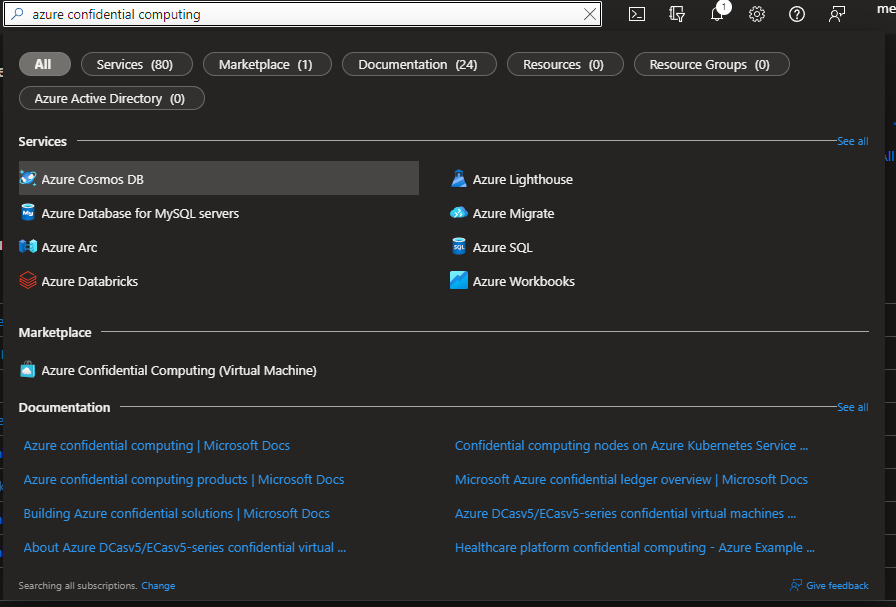

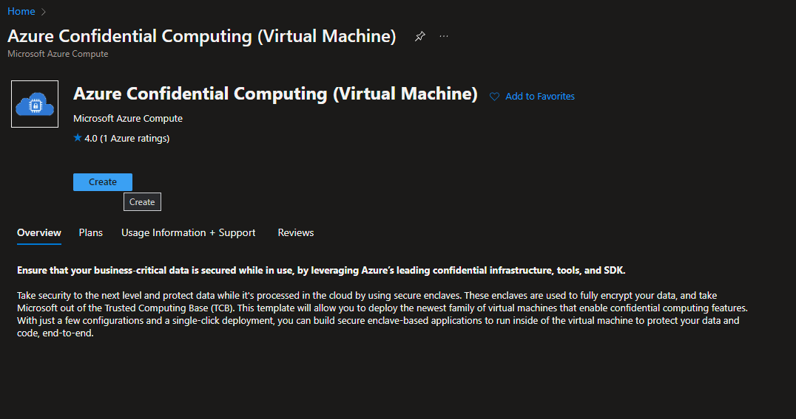

After this, you should see a configuration screen. Please select either **Ubuntu 18.04 or 20.04.**

!!! warning "Security warning"

	It is strongly advised to use a SSH public key in order to use the VM.

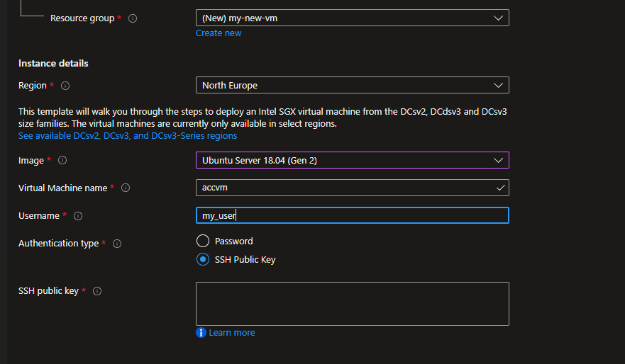

On the next page, choose the VM you want to use. We strongly advise you to pick the **DC2sv3 VM** to test BlindAI. Then, **allow the connection from SSH** and continue.

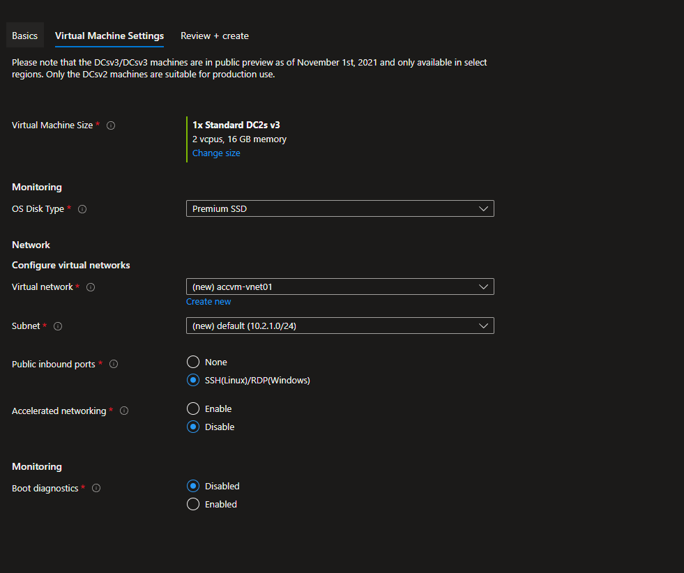

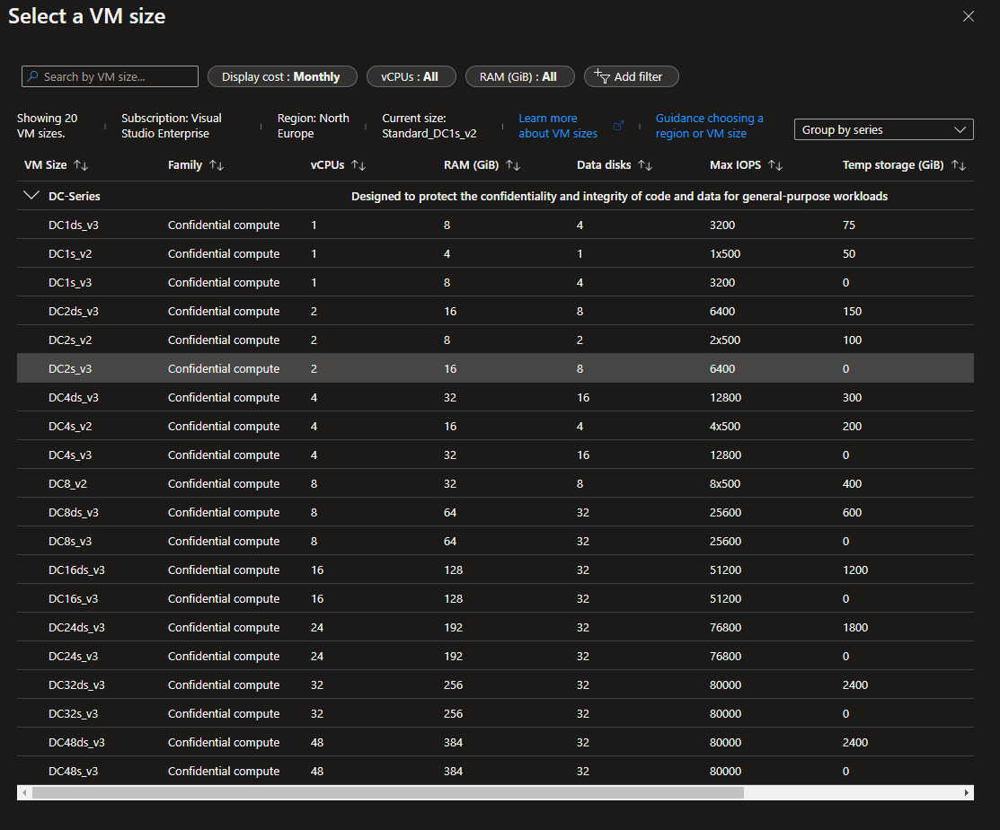

Finally, you can validate and create the VM.

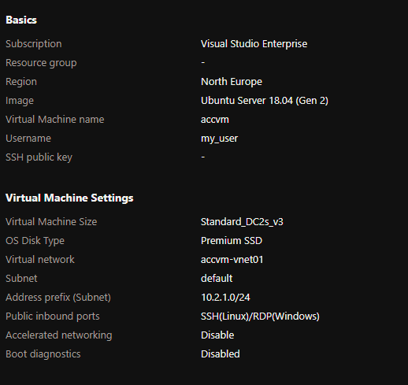

You might have to wait a few minutes for your VM to be successfully deployed!

Once it is deployed, you can connect to it - but we **strongly advise you to set up a DNS name**, in order to simplify the connection as much as possible beforehand.

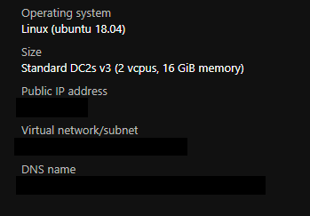

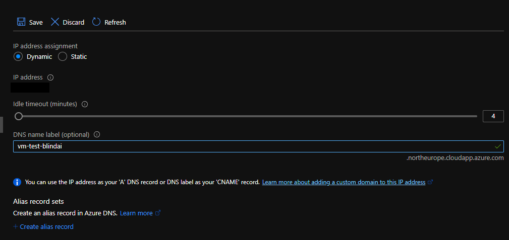

Then you'll have to **open the ports used by BlindAI**: default ports **9923** and **9924**.

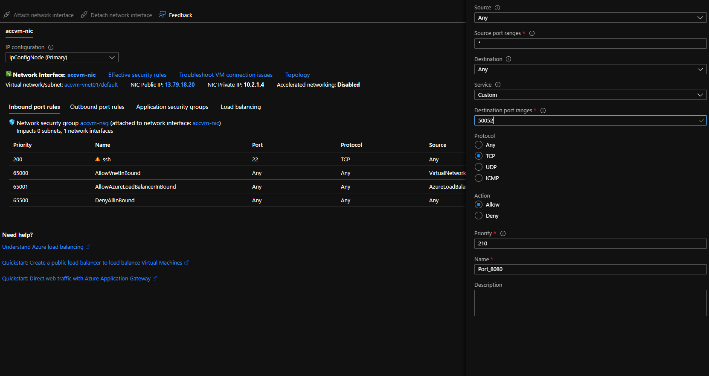

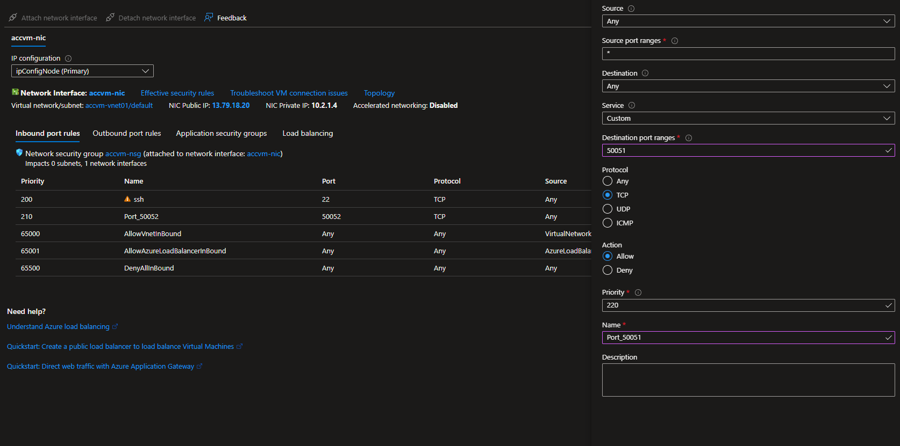

### Using the VM

You can now start the VM. In order to have a good user experience, we recommend you download [**Visual Studio Code**](https://code.visualstudio.com/) and get the extension [**Remote - SSH**](https://marketplace.visualstudio.com/items?itemName=ms-vscode-remote.remote-ssh).

Setting up a SSH connection is fairly easy in Visual Studio Code. All you need to do is add a SSH Host (you can find this option in **the Command Palette**):&#x20;


After that, you need to select "Connect to Host" in **the Command Palette** and select your DNS name.


### Server deployment

You can run the docker image on your VM, with the following command:

```bash
docker run -it -e BLINDAI_AZURE_DCS3_PATCH=1 -p 9923:9923 -p 9924:9924 \
--device /dev/sgx/enclave --device /dev/sgx/provision \
-v /var/run/aesmd/aesm.socket:/var/run/aesmd/aesm.socket \
mithrilsecuritysas/blindai-server:latest /root/start.sh
```

> If you need to install Docker, you can follow [the official Docker installation instructions](https://docs.docker.com/engine/install).

Once the server has been deployed, users can connect to your server by using the client PyPi package API and specifying the server IP address and ports when using BlindAI's `connect()` method.

!!! warning "For production"

	By default, the `unattested_server_port` opened on `9923` is running on *http* only. This port is used for the initial communication with the client to perform verifications. Once the client has verified that the enclave is safe to connect with, it will then communicate with it directly on port 9924.

	For production, we strongly recommend setting up a ***reverse-proxy*** that will manage and encrypt the traffic from the client to the BlindAI server. Many free reverse-proxy implementations exist, such as **caddy**, **Nginx** and **Apache**:

	- [Caddy reverse proxy set-up guide](https://caddyserver.com/docs/quick-starts/reverse-proxy)
	- [Nginx reverse proxy set-up guide](https://docs.nginx.com/nginx/admin-guide/web-server/reverse-proxy/)
	- [Apache reverse proxy set-up guide](https://httpd.apache.org/docs/2.4/howto/reverse_proxy.html)

You can set up your reverse proxy to run on the port of your choice and redirect client traffic to/from the `unattested_server_port` 9923. You will need to inform users what port you are running the reverse proxy on as they will need to modify the `unattested_server_port` option to this port when using BlindAI's `connect()` method to connect to the server.

If you do not set up a reverse proxy, users will need to set the `hazmat_http_on_untrusted_port` option to `True` when using BlindAI's `connect()` function. Again, this is **not recommended** for production.

## On-premise deployment
___________________________________________

### Eligibility check

In order to deploy BlindAI on-premise, you will need an Intel SGX-ready device with `SGX+FLC` support.

You can check this with the following code:

  ```bash
  curl -sSL https://raw.githubusercontent.com/ayeks/SGX-hardware/master/test-sgx.c | gcc -o test-sgx -xc -
  ./test-sgx | grep "sgx launch control"
  ```

- If your output is `sgx launch control: 1`, you **have** an Intel SGX-ready device with `SGX+FLC` support.
- If your output is `sgx launch control: 0`, you **do not have** an Intel SGX-ready device with `SGX+FLC` support.

BlindAI was created for SGX2, which has a better performance and much more memory available than SGX1. The physical protected memory for SGX1 is limited to 128mb.

You could still deploy the server with SGX1 and benefit from the isolation offered by SGX enclaves, but the client will only be able to connect in `simulation` mode since not all attestation checks are possible with SGX1.

You can check if you have SGX1 or SGX2, by running the following:

```bash
curl -sSL https://raw.githubusercontent.com/ayeks/SGX-hardware/master/test-sgx.c | gcc -o test-sgx -xc -
./test-sgx | grep "sgx 1 supported"
```

- If your output is `sgx 1 supported: 1`, you **have** SGX1.
- If your output is `sgx 1 supported: 0`, you **do not have** SGX1.

```bash
./test-sgx | grep "sgx 2 supported"
```

- If your output is `sgx 2 supported: 1`, you **have** SGX2.
- If your output is `sgx 2 supported: 0`, you **do not have** SGX2.

### Intel SGX drivers

>In some cases (Linux kernel >5.15) the execution of the binary returns `in-kernel drivers support`, and it means that the drivers are already installed and must appear in `/dev/sgx/`.

Please make sure to have the `SGX+FLC` drivers (preferably with version **1.41**) installed on your system before continuing.

✅ If you find the drivers named "enclave" and "provision" (or sgx\_enclave and sgx\_provision) in /dev/, you are good to go!

❌ If you have an Intel SGX-ready device with SGX2 but are missing the required drivers, you can install them by doing the following:

```bash
wget https://download.01.org/intel-sgx/sgx-linux/2.15.1/distro/ubuntu18.04-server/sgx_linux_x64_driver_1.41.bin
chmod +x sgx_linux_x64_driver_1.41.bin
./sgx_linux_x64_driver_1.41.bin
```
The binary file contains the drivers signed by Intel and will proceed to the installation transparently.

### Server deployment in three steps

1. **Install and run the `aesm` service.**

	This step allows our host machine to communicate with the enclave. You can do it on Ubuntu with the following steps:

	```bash
	# download aesm for ubuntu
	echo "deb https://download.01.org/intel-sgx/sgx_repo/ubuntu $(lsb_release -cs) main" | sudo tee -a /etc/apt/sources.list.d/intel-sgx.list >/dev/null \
	# add to apt-key list to authenticate package
	curl -sSL "https://download.01.org/intel-sgx/sgx_repo/ubuntu/intel-sgx-deb.key" | sudo apt-key add -
	# update available packages
	sudo apt-get update \
	# install aesm package
	sudo apt-get install -y sgx-aesm-service libsgx-aesm-launch-plugin
	```

	You can verify that the service is now running with:

	```bash
	service aesmd status
	```

	Finally, the current user must also be added to the aesm group:

	```bash
	sudo usermod -a -G aesmd $USER
	```

2. **Deploy the server using our Docker image.**

	You will need to create an Intel Provisioning Certification Caching Service (PCCS) API key. This is necessary to be enable SGX attestation run-time workloads.

	- If you don't already have one, you'll need to create an account with [Intel](https://www.intel.com/content/www/us/en/homepage.html).
	- Once you have an account, follow this [link](https://api.portal.trustedservices.intel.com/provisioning-certification) and make sure you are logged in.
	- Select `subscribe` in the `Get PCK Certificate/s` section.
	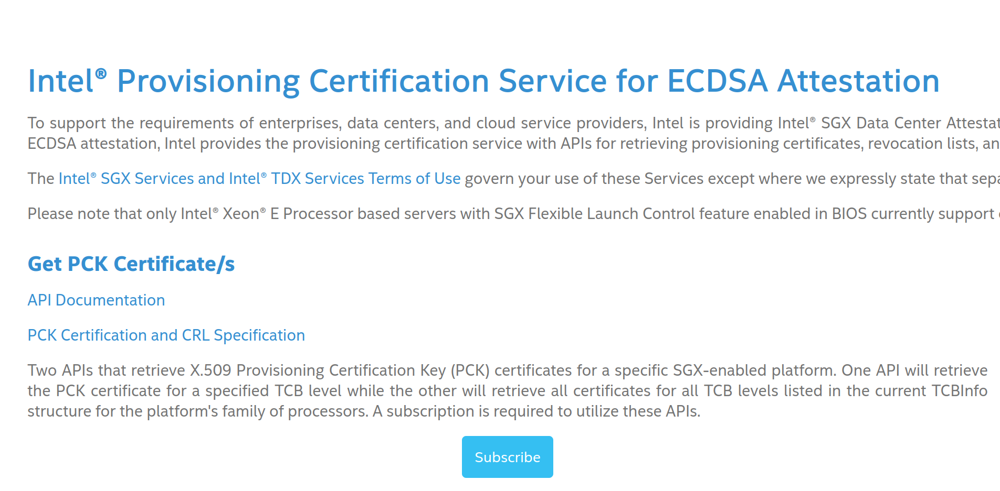
	- On the following screen, select `Add subscription`
	
	- This will lead you to a page detailing your subscription. To view your API key you can click on `Show` under `primary key`. This is the key you will need in order to deploy the Docker image.
	

3. **Run the docker image.**

	```bash
	docker run -it -p 9923:9923 -p 9924:9924 \
	--device /dev/sgx/enclave --device /dev/sgx/provision \
	-v /var/run/aesmd/aesm.socket:/var/run/aesmd/aesm.socket \
	mithrilsecuritysas/blindai-server:latest /root/start.sh [PCCS_API_KEY]
	```

	>If you need to install Docker, you can follow [the official Docker installation instructions](https://docs.docker.com/engine/install).

	Once the server has been deployed, users can connect to your server by using the client PyPi package API and specifying the server IP address and ports when using BlindAI's `connect()` method.

	!!! warning "For production"

		By default, the `unattested_server_port` opened on `9923` is running on *http* only. This port is used for the initial communication with the client to perform verifications. Once the client has verified that the enclave is safe to connect with, it will then communicate with it directly on port 9924.

		For production, we strongly recommend setting up a ***reverse-proxy*** that will manage and encrypt the traffic from the client to the BlindAI server. Many free reverse-proxy implementations exist, such as **caddy**, **Nginx** and **Apache**:

		- [Caddy reverse proxy set-up guide](https://caddyserver.com/docs/quick-starts/reverse-proxy)
		- [Nginx reverse proxy set-up guide](https://docs.nginx.com/nginx/admin-guide/web-server/reverse-proxy/)
		- [Apache reverse proxy set-up guide](https://httpd.apache.org/docs/2.4/howto/reverse_proxy.html)

	You can set up your reverse proxy to run on the port of your choice and redirect client traffic to/from the `unattested_server_port` 9923. You will need to inform users what port you are running the reverse proxy on as they will need to modify the `unattested_server_port` option to this port when using BlindAI's `connect()` method to connect to the server.

	If you do not set up a reverse proxy, users will need to set the `hazmat_http_on_untrusted_port` option to `True` when using BlindAI's `connect()` function. Again, this is **not recommended** for production.

## Building from source (advanced)
_______________________________________________________

If you want to **build from source**, perhaps because you want to contribute to the project or build from a certain branch or commit, you can find all the information you need to do so in our [building from source guide]( ../../advanced/build-from-sources/server.md ).
